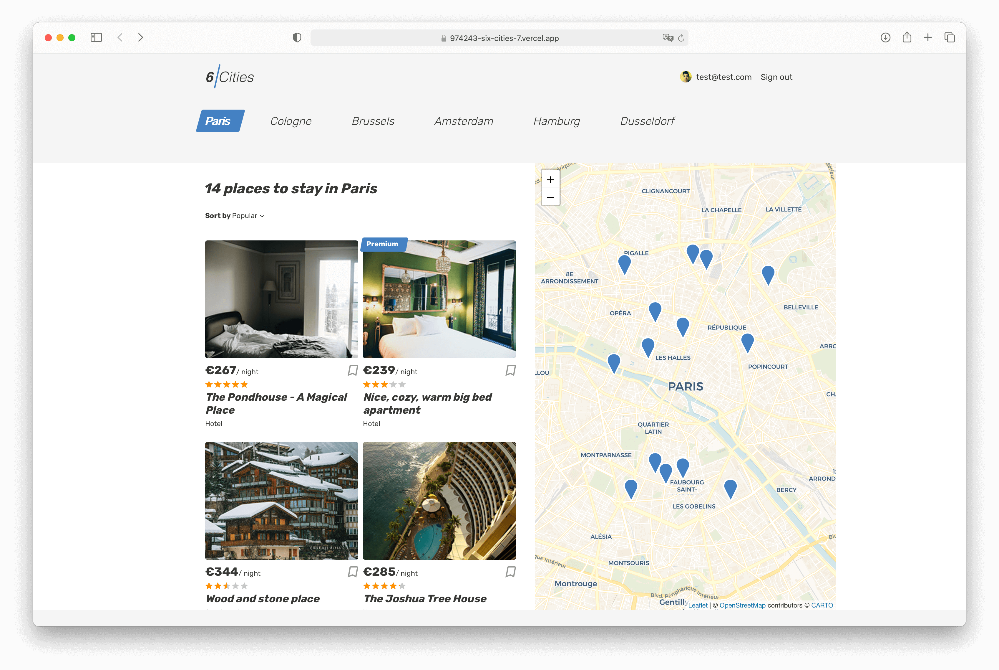

# Проект «Шесть городов»
Небольшое SPA по поиску предложений по аренде в шести городах

---
Опубликованная версия - https://974243-six-cities-7.vercel.app

---
Используемые технологии:
 - React
 - Redux, Redux Toolkit, Redux Thunk
 - Axios
 - Jest, React Testing library
 - PropTypes

Дополнительные библиотеки:
 - Leaflet
 - React Content Loader

---
Для запуска проекта локально:
1. Клонируйте репозиторий к себе на компьютер
2. Перейдите в папку /project
3. Выполните `npm i` для установки зависимостей
4. Запустите проект `npm start`

---
## Превью:

